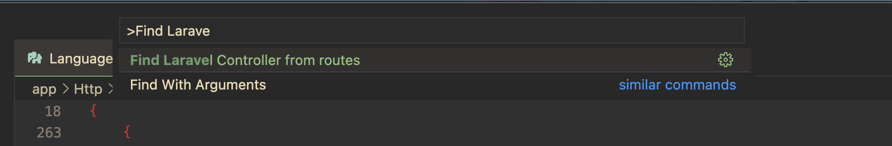
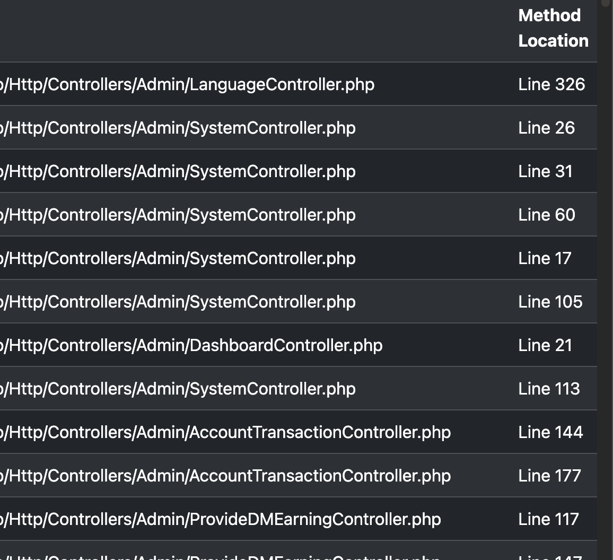

## Laravel Routes to Controller Finder

This extension will help to find Laravel route to the controller location with method line. This might have issue because it's a first release, It's very easy to use just install it and run with

Windows/Linux:
```
Ctrl + Shift + P
```

MacOS:
```
Cmd + Shift + P
```

Select `> Find Laravel Controller from routes`

#### Screenshots
**Select from command palette:**


**Output:**



> [!NOTE]  
> The output screenshot is the last part of there are more in left side.


Feel free to contribute.